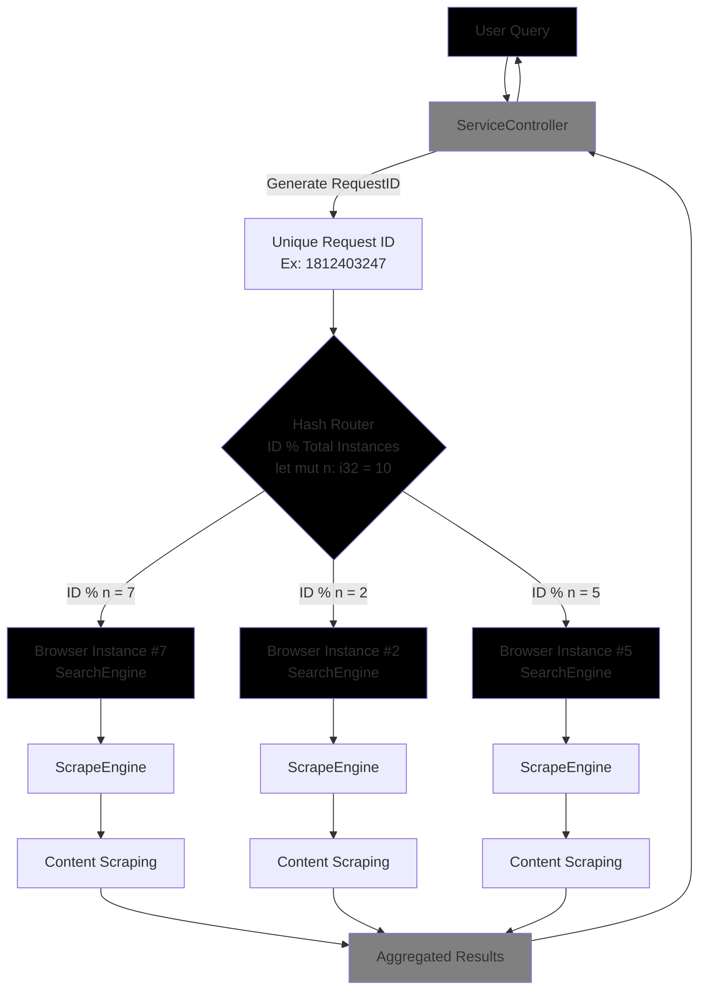
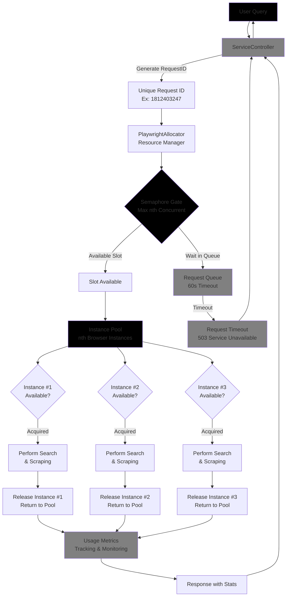

# Web MCP

[](https://spring.io/projects/spring-boot)
[](https://www.docker.com/)


The MCP Web Scraper is a ***simple and scalable*** web tool built with Spring Boot, providing reliable and efficient web data extracting and structuring capabilities for various AI-driven tasks.

This tool uses Playwright for browser automation, allowing it to handle modern, JavaScript-heavy websites with ease. It exposes a simple REST API for initiating web scrapes, making it easy to integrate with other services.

## Features

*   **Simple Web Scraping:** Uses `Playwright` to render and scrape modern web pages.
*   **Simple Search Integration:** Searches `DuckDuckGo` to find relevant pages before scraping.
*   **RestFul API:** Provides a simple API for initiating scrapes.
*   **Scalable Architecture:** Utilizes multiple Playwright instances and `hash routing` to handle `concurrent requests` safely. (Will replace this with ```ThreadPool``` and ```ExecutorService```)
*   **AI:** To be integrated with AI models for `structured data extraction` and analysis. (***TODO***)


## ***Simple Design (dev)***


`Pseudo code `

```java
public PlaywrightBrowserSearchTools getSearchInstance(int requestId) {
    int index = Math.abs(requestId % instances);
    return searchTools[index]; // allocate a browser to req directly,prone to conflict
}
```

## ***Improved Design***


`Pseudo code `

```java
public PlaywrightBrowserSearchTools borrowSearchInstance(int requestId) {
    // checks if available or busy, conflict-proof
    if (searchSemaphore.tryAcquire(60, TimeUnit.SECONDS)) return findAndLockAvailableInstance(requestId);
    return null; // timeout
}
```


## Tech Stack

*   **Backend:** Spring Boot 3.5.5
*   **Language:** Java 17
*   **Web Scraping:** Playwright
*   **Search Engine:** DuckDuckGo (Reliable)
*   **Build Tool:** Maven
*   **Cloud Service:** Oracle Cloud (Ubuntu Environment)

## Getting Started

### Prerequisites

*   Java 17+
*   Maven

### Build from src

```bash
mvn clean install -DskipTests -U
```

```bash
mvn spring-boot:run
```

### Docker (Minimum 12GB+ RAM ~ 20 workers)

```bash
docker-compose -f docker-compose.dev.yaml up --build
```
```bash
docker-compose -f docker-compose.prod.yaml up --build
```

#### Build image manually

```bash
docker build -t simpl-webscraper:latest .
```

`Run development container`

```bash
docker run -d \
--name webscraper-dev \
-p 3000:3000 \
-e SPRING_PROFILES_ACTIVE=dev \
-e playwright.instances=15 \
-v $(pwd)/logs:/app/logs \
--init --ipc=host \
simpl-webscraper:latest
````

`Run production container`

```bash
docker run -d \
--name webscraper-prod \
-p 3001:3000 \
-e SPRING_PROFILES_ACTIVE=prod \
-e playwright.lockInstances=20 \
-v $(pwd)/logs:/app/logs \
--init --ipc=host \
simpl-webscraper:latest
````

The application (default) will be available at `http://localhost:3000`.

## API Endpoint

### `POST /api/v1/search`

This endpoint allows you to initiate a web data scrape, with ***source, snippet and contents***.

**Request Body:**

```json
{
  "query": "hamster foods",
  "results": 3
}
```

**Example `curl` command:**

```bash
curl -X POST -H "Content-Type: application/json" -d '{
  "query": "what are mcp server?"
  "results": 5
}' http://localhost:3000/api/v1/service/search
```

**Example Response:**

```json
{
  "responseId" : 253600510,
  "userQuery" : "hamster foods",
  "searchResultList" : [ {
    "success" : true,
    "source" : "https://www.thesprucepets.com/feeding-pet-hamsters-1238968",
    "snippet" : "Hamster Food 101: What Can Hamsters Eat? - The Spruce Pets",
    "content" : "The Ultimate Guide to Hamster Food: What to Feed Your Pet Explore balanced diets and tasty treats for your rodent pet By LIANNE MCLEOD...",
    "error" : null
  }, {
    "success" : true,
    "source" : "https://www.animallama.com/hamsters/hamster-food-list/",
    "snippet" : "Safe & Unsafe Hamster Food List: Veggies, Fruits, Herbs ... - Animallama",
    "content" : "DIET & HEALTH | HAMSTERS Safe & Unsafe Hamster Food List: Veggies, Fruits, Nuts, Seeds, Herbs, Protein & More By Monika Kucic Updated on July 18...",
    "error" : null
  }, {
    "success" : true,
    "source" : "https://www.petmd.com/exotic/what-can-hamsters-eat",
    "snippet" : "What Can Hamsters Eat? - PetMD",
    "content" : "Home What Can Hamsters Eat? By Angelina Childree, LVT . Reviewed by Melissa Witherell, DVM Updated Jul. 23, 2024 Inventori/iStock / Getty Images Plus via Getty Images IN THIS ARTICLE...",
    "error" : null
  } ],
  "message" : "Routing to #4, #4 instances"
}
```
