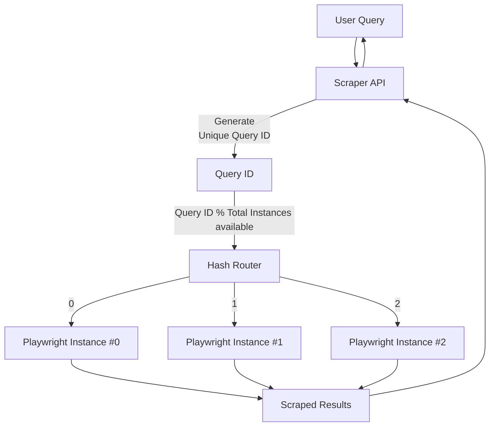

# MCP Web Scraper

[](https://spring.io/projects/spring-boot)

The MCP Web Scraper is a ***simple and scalable*** web scraping tool built with Spring Boot. It's designed to be a core component of the MCP (Master Control Program) ecosystem, providing reliable and efficient web scraping capabilities for various AI-driven tasks.

This tool leverages Playwright for robust browser automation, allowing it to handle modern, JavaScript-heavy websites with ease. It exposes a simple REST API for initiating web scrapes, making it easy to integrate with other services.

## Features

*   **Robust Web Scraping:** Uses `Playwright` to render and scrape modern web pages.
*   **Simple Search Integration:** Searches `DuckDuckGo` to find relevant pages before scraping.
*   **RestFul API:** Provides a simple API for initiating scrapes.
*   **Scalable Architecture:** Utilizes multiple Playwright instances and `hash routing` to handle `concurrent requests` safely. (Will replace this with ```ThreadPool``` and ```ExecutorService```)
*   **AI:** To be integrated with AI models for `structured data extraction` and analysis. (***TODO***)




## Tech Stack

*   **Backend:** Spring Boot 3.5.5
*   **Language:** Java 17
*   **Web Scraping:** Playwright
*   **Search Engine:** DuckDuckGo
*   **Build Tool:** Maven
*   **Cloud Service:** Oracle Cloud (Ubuntu Environment)

## Getting Started

### Prerequisites

*   Java 17
*   Maven

### Installation

1.  Clone the repository:
    ```bash
    git clone https://github.com/ronakgh97/webScraper.git
    ```
2.  Navigate to the project directory:
    ```bash
    cd webScraper
    ```
3.  Install the dependencies:
    ```bash
    mvn install
    ```

### Running the Application

```bash
mvn spring-boot:run
```

The application will be available at `http://localhost:3000`.

## API Endpoint

### `POST /api/v1/search`

This endpoint allows you to initiate a web scrape.

**Request Body:**

```json
{
  "query": "hamster foods"
}
```

**Example `curl` command:**

```bash
curl -X POST -H "Content-Type: application/json" -d '{
  "query": "what is the capital of france"
}' http://localhost:8080/api/v1/search
```

**Example Response:**

```json
{
  "responseId" : 253600510,
  "userQuery" : "hamster foods",
  "searchResultList" : [ {
    "success" : true,
    "source" : "https://www.thesprucepets.com/feeding-pet-hamsters-1238968",
    "snippet" : "Hamster Food 101: What Can Hamsters Eat? - The Spruce Pets",
    "content" : "The Ultimate Guide to Hamster Food: What to Feed Your Pet Explore balanced diets and tasty treats for your rodent pet By LIANNE MCLEOD...",
    "error" : null
  }, {
    "success" : true,
    "source" : "https://www.animallama.com/hamsters/hamster-food-list/",
    "snippet" : "Safe & Unsafe Hamster Food List: Veggies, Fruits, Herbs ... - Animallama",
    "content" : "DIET & HEALTH | HAMSTERS Safe & Unsafe Hamster Food List: Veggies, Fruits, Nuts, Seeds, Herbs, Protein & More By Monika Kucic Updated on July 18...",
    "error" : null
  }, {
    "success" : true,
    "source" : "https://www.petmd.com/exotic/what-can-hamsters-eat",
    "snippet" : "What Can Hamsters Eat? - PetMD",
    "content" : "Home What Can Hamsters Eat? By Angelina Childree, LVT . Reviewed by Melissa Witherell, DVM Updated Jul. 23, 2024 Inventori/iStock / Getty Images Plus via Getty Images IN THIS ARTICLE...",
    "error" : null
  } ],
  "message" : "Routing to #4, #4 instances"
}
```